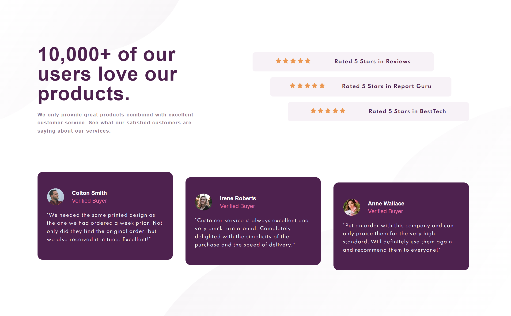

# Frontend Mentor - Social proof section solution

This is a solution to the [Social proof section challenge on Frontend Mentor](https://www.frontendmentor.io/challenges/social-proof-section-6e0qTv_bA). Frontend Mentor challenges help you improve your coding skills by building realistic projects.

## Table of contents

- [Frontend Mentor - Social proof section solution](#frontend-mentor---social-proof-section-solution)
  - [Table of contents](#table-of-contents)
  - [Overview](#overview)
    - [The challenge](#the-challenge)
    - [Screenshot](#screenshot)
    - [Links](#links)
  - [My process](#my-process)
    - [Built with](#built-with)
    - [What I learned](#what-i-learned)
    - [Continued development](#continued-development)
  - [Author](#author)
  - [Acknowledgments](#acknowledgments)

## Overview

Create and layout the visual design of the social proof section of a website. This will be done by HTML5 and CSS3

### The challenge

Users should be able to:

- View the optimal layout for the section depending on their device's screen size (mobile or desktop)

### Screenshot



### Links

- Solution URL: [FEM Solution Link](https://www.frontendmentor.io/solutions/responsive-gridflex-social-proof-section-bh6qV58iD)
- Live Site URL: [Deployed Site Link](https://brianj-27.github.io/social-proof-section/)

## My process

This was my first shot in a while with adding node.js into my workflow. I personally like to finish the project layout and styling and then push my code up to github. If I have to make changes, I can easily come in and do that afterwards

### Built with

- Semantic HTML5 markup
- Flexbox
- CSS Grid
- Sass Architecture
- Sass Variable
- node.js
- Mobile-first workflow

### What I learned

I learned how to use `transform: translateX(x)`. I didn't use this before. I also learned to setup a node based project.

```css
body {
  background: url(../assets/images/bg-pattern-top-mobile.svg) no-repeat top 0px
      left 0px, url(../assets/images/bg-pattern-bottom-mobile.svg) no-repeat
      bottom 0px right 0px, $color-bg;
  margin: 1rem auto;
  @include mq("lg") {
    background: url(../assets/images/bg-pattern-top-desktop.svg) no-repeat top
        0px left 0px, url(../assets/images/bg-pattern-bottom-desktop.svg)
        no-repeat bottom 0px right 0px, $color-bg;
  }
}
```

### Continued development

Use this section to outline areas that you want to continue focusing on in future projects. These could be concepts you're still not completely comfortable with or techniques you found useful that you want to refine and perfect.

## Author

- Website - [Add your name here](https://www.your-site.com)
- Frontend Mentor - [@yourusername](https://www.frontendmentor.io/profile/yourusername)
- Twitter - [@yourusername](https://www.twitter.com/yourusername)

**Note: Delete this note and add/remove/edit lines above based on what links you'd like to share.**

## Acknowledgments

This is where you can give a hat tip to anyone who helped you out on this project. Perhaps you worked in a team or got some inspiration from someone else's solution. This is the perfect place to give them some credit.

**Note: Delete this note and edit this section's content as necessary. If you completed this challenge by yourself, feel free to delete this section entirely.**
